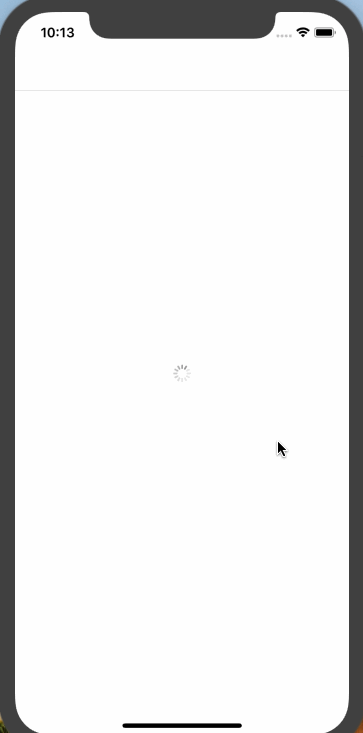

# LoadingRetry

<html> <p align="center">



</p>

</html>

[](https://travis-ci.org/srv7/LoadingRetry)
[](https://cocoapods.org/pods/LoadingRetry)
[](https://cocoapods.org/pods/LoadingRetry)
[](https://cocoapods.org/pods/LoadingRetry)

## Example

To run the example project, clone the repo, and run `pod install` from the Example directory first.

## Requirements

iOS | 9.0+
---|---
swift | 4.2+


## Usage

1. confirm to protocol `LoadingRetryType`. e.g.

   ```swift
   class ViewController: UIViewController, LoadingRetryType {
   
   }
   ```

2. implement requirements of protocol `LoadingRetryType`,  provide your `loadingView` and `errorView` viewControllerType.

   ```swift
   class ViewController: UIViewController, LoadingRetryType {
       lazy var loadingView: LoadingViewController = {
           return LoadingViewController()
       }()
   
       lazy var errorView: ErrorViewController = {
           return ErrorViewController()
       }()
   }
   ```

3. call `setLoadingView(visible: Bool)` and `setErrorView(visible: Bool)` to control the display of `loadingView` and `errorView`.

   ```swift
   viewController.setLoadingView(visible: visible)
   viewController.setErrorView(visible: visible)
   ```

## Installation

LoadingRetry is available through [CocoaPods](https://cocoapods.org). To install
it, simply add the following line to your Podfile:

```ruby
pod 'LoadingRetry'
```

## Rx Support

```ruby
pod 'LoadingRetry/RxSwift'
```

`LoadingRetry` also add rx support. if you are using RxSwift, you can control the display of `loadingView` and `errorView` by using `loadingViewVisible`  and `errorViewVisible`  extension property of `UIViewController`.

```swift
viewModel.fetchDataAction.executing.bind(to: rx.loadingViewVisible).disposed(by: bag)

viewModel.fetchDataAction.executing
            .filter { $0 }.map { !$0 }
            .bind(to: rx.errorViewVisible)
            .disposed(by: bag)

        viewModel.fetchDataAction.errors
            .map { _ in true }
            .bind(to: rx.errorViewVisible)
            .disposed(by: bag)
```

## Author

srv7, liubo004@126.com

## License

LoadingRetry is available under the MIT license. See the LICENSE file for more info.
